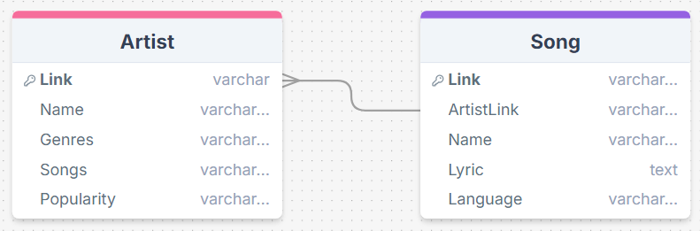

# Proyecto 2 - IC4302 Bases de Datos II

## Introduction
Following is the documentation for 'Proyecto 2' of the course IC4302 - Databases II.
This project assignment focuses on developing a web application prototype called TuneStay, which integrates multiple technologies, including MongoDB Atlas, Elasticsearch, PostgreSQL, and Google Cloud Storage. TuneStay is designed to manage tasks such as dataset loading and processing, generating text embeddings, and querying across both relational and non-relational databases. To optimize its search capabilities, the system supports full-text and embedded vector searches, and is deployed in Kubernetes to ensure scalability and manageability.

The application is deployed in a Kubernetes environment using Helm Charts, ensuring scalability, manageability, and observability. Each component is containerized using Docker, packaging only the necessary dependencies and database interactions. To streamline data access, the system utilizes Google Cloud Storage for dataset management, and all datasets are parsed and stored in both PostgreSQL and MongoDB Atlas.

Additionally, a simple React-based UI is implemented, allowing users to interact with the system in a user-friendly way. The UI supports functionality such as selecting the search engine (PostgreSQL or MongoDB Atlas), entering search terms to query song lyrics and artists, refining results by facets such as language, genre, and popularity, and displaying song details. Users can also select specific song verses to initiate related searches for apartment recommendations using embedding-based queries. The UI is deployed as a Kubernetes Deployment and exposed via NodePort for external access, interacting with the backend API to manage search requests, parse song data, and display recommendations.

## Team Members
- Victor Aymerich
- Anthony Barrantes
- Fabricio Solis 
- Melanie Wong
- Pavel Zamora 

Next up, you will find the requirements to run the application, the steps to execute it, testing examples and the recommendations and conclusions we have gathered from the homework.
## Requirements

The requirements for the project are the following:

* Create an user in [DockerHub](https://hub.docker.com/)
* Install [Docker Desktop](https://docs.docker.com/desktop/install/windows-install/), if you are using MacOS, please make sure you select the right installer for your CPU architecture.
* Open Docker Desktop, go to **Settings > Kubernetes** and enable Kubernetes.

* Install [Kubectl](https://kubernetes.io/docs/tasks/tools/install-kubectl-macos/)
* Install [Helm](https://helm.sh/docs/intro/install/)
* Install [Visual Studio Code](https://code.visualstudio.com/)
* Install [Lens](https://k8slens.dev/)


## Building the docker images

There is a script to build the docker images, to execute it in a bash shell execute:

```bash
cd ./P2/docker
./build.sh nereo08
```

Change **nereo08** to your DockerHub username

Please take a look on the script contents to make sure you understand what is done under the hood.
This script will build the images for the components of the homework, including the database, the API, the cache, and the monitoring components.

## Helm Charts

### Configure

* Open the file **P2/charts/application/values.yaml**
* Replace **nereo08** by your DockerHub username

```yaml
config:
  docker_registry: nereo08
```

### Install

Execute:

```bash
cd ./P2/charts
./install.sh
```

Here we are installing the components in the Kubernetes cluster. The script will install the databases, the loader, the migrator, the backend and frontend. It is important to have the DockerHub username set correctly in the script to ensure the correct components are installed.

### Uninstall

Execute:

```bash
cd ./P2/charts
./uninstall.sh
```

This script will uninstall the components from the Kubernetes cluster. It is important to have the DockerHub username set correctly in the script to ensure the correct components are removed.

## Access Debug Pod

```bash
# copy the name that says debug from the following command
kubectl get pods
# then replace debug-844bb45d6f-9jt45 by that name
kubectl exec --stdin --tty debug-844bb45d6f-9jt45 -- /bin/bash
```
In case you need to access the debug pod to check the logs or execute some commands, you can use the previous command to access it.


# How to Test

To test the whole project together, you can follow the next steps:
First you need to do the build and install steps, in this time you have to choose the components that will be used for this you have to change in P2\charts\application\values.yaml, after that to verify that the project is working correctly you can follow the next steps:

- Check that the Docker images are running; you can verify this in the Docker Desktop application. In this area, it’s essential to monitor the different images, as you can review their logs to identify any potential errors. Specifically, check the logs for the following images: the Loader, Migrator, Backend API, Elasticsearch, MongoDB Atlas, PostgreSQL, and Kubernetes services. To view the logs, click on the image and select the logs option to ensure each component is functioning as expected.

- After that you can check in Lens that the pods are running correctly, here you can check the logs of the pods to see if there are any errors and the status of the pods.

- The frontend for TuneStay is also available for testing. You can access it by forwarding the port of the frontend service, frontend-deployment, to your local machine. Once forwarded, access the frontend by navigating to http://localhost:(Port you decide), where you can interact with the UI. The frontend provides a user-friendly interface, allowing users to explore the TuneStay system with features like choosing search engines (PostgreSQL or MongoDB Atlas), conducting song and artist searches, and refining results by language, genre, and popularity. Users can view song details, select verses, and initiate apartment searches based on selected lyrics. The frontend communicates with the backend API to execute queries, process embeddings, and present data in real-time.

# Recommendations and Conclusions

## Recommendations

To successfully complete the project, the following recommendations are provided to help you navigate the different components and technologies involved:

1. **Learn How to Use a Kubernetes Cluster**
   - **Recommendation**: It is very important to get a basic understanding of Kubernetes, what is their function and how it works, as the whole project is designed to run in a Kubernetes cluster.
   - **Reason**: Knowing how to deploy and manage the application in Kubernetes will help you run the project in a real-world environment.

2. **Learn How to Use Helm Charts**
   - **Recommendation**: Learn how to use Helm charts, which are used to deploy the application in Kubernetes. It is relevant to understand how they work and what it their function so you can deploy the application correctly.
   - **Reason**: The project uses Helm charts to deploy the application in Kubernetes. Knowing how to use Helm charts will help you manage the deployment of the application.

3. **Get Familiar with MongoDB Atlas**
   - **Recommendation**: Learn the basics of MongoDB Atlas, a primary database in TuneStay, including how to connect, view collections, and check data.
   - **Reason**: Connecting to MongoDB Atlas is necessary to verify that data is being properly stored and updated.

4.  **Get Familiar with Elasticsearch Indexing**
   - **Recommendation**: Study Elasticsearch basics, especially regarding index creation and management, as data will be stored and queried here.
   - **Reason**: Efficient data storage and retrieval are essential to TuneStay's performance, making familiarity with Elasticsearch indices crucial.
  
5.  **Monitor Resource Usage**
   - **Recommendation**: Keep an eye on resource usage (CPU, memory) while running the script to ensure it operates within acceptable limits.
   - **Reason**: Monitoring helps prevent performance bottlenecks and ensures that the script runs efficiently, particularly for large datasets.

6.  **Document Configuration and Steps**
    - **Recommendation**: Document the configuration parameters and execution steps clearly for future reference and ease of use.
    - **Reason**: Clear documentation helps users understand the setup and execution process, making it easier to troubleshoot and replicate the environment.
  
7.  **Understand the Data Schema**
    - **Recommendation**: Familiarize yourself with the data schema and relationships between tables to structure efficient queries in both PostgreSQL and MongoDB Atlas.
    - **Reason**: Understanding the data schema helps optimize queries and ensures accurate results when fetching data from the databases.

8. **Understand Google Cloud Storage**
   - **Recommendation**: Learn how to connect and retrieve datasets from Google Cloud Storage.
   - **Reason**: Familiarity with Google Cloud Storage enables efficient dataset management and integration with TuneStay’s database components.

9. **Understand PostgreSQL**
   - **Recommendation**: Learn the basics of PostgreSQL, which is used as TuneStay’s relational database for structured song data.
   - **Reason**: Understanding PostgreSQL enables effective data organization, search functionality, and integration with other system components.

10. **Understand React**
    - **Recommendation**: Learn how to use React, which is used to create the frontend of the project.
    - **Reason**: Understanding how to use React will help you interact with the UI and understand how the frontend interacts with the backend.
  
11. **Understand API Development**
    - **Recommendation**: Learn the principles of API development as the TuneStay application relies on a backend API for communication between the frontend and various services.
    - **Reason**: Understanding API design and implementation will help you effectively manage data requests and responses, ensuring seamless interactions within the application.
  

## Conclusions 

1. Analyzing the Desired Functionality: The project aims to provide a comprehensive search and recommendation system for song lyrics and apartment listings. By integrating multiple technologies, such as PostgreSQL, MongoDB Atlas, Elasticsearch, and Google Cloud Storage, the system offers advanced search capabilities, real-time data processing, and efficient data storage. The project's architecture is designed to handle large datasets, process unstructured text data, and provide personalized recommendations. It is essential to understand the desired functionality and user requirements to design an effective system that meets user expectations and delivers a seamless user experience.

2. Containerized Scalability: The use of Kubernetes allows the system to scale horizontally, adding or removing instances as needed to handle varying loads. This ensures that the project can support high levels of concurrency and data throughput, essential for real-time applications.

3. Efficient Data Handling:  The incorporation of PostgreSQL enables effective management of large data volumes, while Elasticsearch enhances the system's capabilities with fast and scalable search functionalities, even in extensive or distributed databases.
   
4. Interactive User Interface: The project provides a user-friendly interface for users to interact with the system, which counts with various features, such as selecting the search engine, exploring song lyrics, and viewing recommended apartments. The UI is designed to allow users to navigate and explore seamlessly, enabling them to filter results, view song details, and perform customized searches quickly and efficiently.

5. Efficient Embedding Generation: The project uses Sentence Transformers to generate embeddings for 
Embeddings are essential for processing unstructured data and performing advanced queries, enhancing the system's search capabilities and user experience.
   
6. Efficient Data Handling: The project effectively manages data from external sources, such as Google Cloud Storage, ensuring that it is processed, embedded for vector search capabilities, and stored seamlessly in Elasticsearch. This approach maintains data integrity and supports scalability.
   
7. Flexible and Extensible Design: The application's architecture allows for easy integration of new features or components. Whether it's adding more data sources, expanding ElasticSearch indices, or integrating additional APIs, the design supports continuous development and flexibility.

8. Real-Time Execution: The project is designed to process data in real time, ensuring that new data is ingested, processed, and stored efficiently. This real-time processing capability is essential for applications that require up-to-date information and fast response times.

9. Cross-Platform Compatibility: By leveraging web-based and containerized components, the project is accessible across various platforms, allowing it to operate seamlessly on different environments without compatibility issues. This adaptability broadens its usability, making it suitable for deployment across a wide range of infrastructures.  
 
10. Advanced Data Enrichment Capabilities: By leveraging embeddings and language models, the project transforms unstructured text data into meaningful vector representations. This enrichment allows for enhanced querying and recommendation accuracy, adding value to search functionalities by making them context-aware and personalized.
    
11. Importance of Diveriity of Technologies: The project's use of multiple technologies, such as PostgreSQL, MongoDB Atlas, Elasticsearch, and Google Cloud Storage, demonstrates the importance of selecting the right tools for specific tasks. Each technology brings unique capabilities to the project, enabling efficient data storage, retrieval, and search functionalities. The diversity of technologies ensures that the project can handle complex data processing requirements and deliver optimal performance.  

# Components

## Databases:

The databases used in the project are PostgreSQL, MongoDB Atlas, and Elasticsearch. These databases are widely used in the industry and offer features for storing and managing data. 

PostgreSQL is a popular open-source relational database management system that is well-known for its performance, scalability, and reliability. It ensures data integrity and consistency, making it an excellent choice for storing user information and structured object data. PostgreSQL supports advanced features such as replication, clustering, and high availability, which are essential for handling large volumes of data.

MongoDB Atlas is a fully managed cloud database service that provides a flexible and scalable NoSQL database solution. It is designed for storing unstructured data and offers features like automatic scaling, sharding, and data distribution. MongoDB Atlas is suitable for handling diverse data types and supporting dynamic schemas, making it ideal for storing song lyrics and other unstructured data.

Elasticsearch is also a popular NoSQL database that is used for full-text search and analytics. It is designed for real-time search and analysis of large volumes of data. It offers features like full-text search, aggregations, and spatial search, making it suitable for handling complex data structures and performing advanced queries.

The databases are used to store and manage various types of data, including song lyrics, embeddings, and search indices. Each database serves a specific purpose, providing an efficient and organized solution for handling and retrieving data across different components. The relational and non-relational databases complement each other, enabling comprehensive data management tailored to the application’s needs.

PostgreSQL has the following tables:

- Artist: Stores information about artists, including their name, genres, songs, popularity, and link.
- Song: Stores information about songs, including the artist link, name, link, lyric, and language.

MongoDB Atlas has a collection called listingsAndReviews, which stores detailed information about songs, including metadata, descriptive details, and embeddings. The collection structure includes general fields, embeddings, artist information, location, availability, ratings, reviews, and additional details.

Elasticsearch has an index called listingsAndReviews, which stores the same data as the MongoDB Atlas collection, along with additional fields specific to Elasticsearch. The index structure includes general fields, embeddings, artist information, location, availability, ratings, reviews, and additional details.

## Loader: 

The Loader component is responsible for loading data from external sources, processing it, and storing it in the databases within the TuneStay project. Running as a Python application within a Kubernetes Job, the Loader retrieves data from Google Cloud Storage, processes it and stores the processed data in both PostgreSQL and MongoDB Atlas. This component ensures efficient data ingestion, accurate processing, and secure storage within the databases. By automating the data loading process, the Loader streamlines data management, ensuring that the databases remain up-to-date with the latest information. The Loader is essential for maintaining data consistency and enabling seamless data access across the application. 

## Migrator:

The Migrator component is responsible for processing and transferring data to Elasticsearch within the TuneStay project. Running as a Python application in a Kubernetes Job, the Migrator reads documents from a MongoDB Atlas test collection (sample_airbnb.listingsAndReviews), processes these records using a Large Language Model (LLM), in this case we use `SentenceTransformers` to generate embeddings for fields like name, summary, description, and reviews[*].comments, and then stores the enriched documents in an Elasticsearch index (listingsAndReviews). This automated process enables efficient, vector-based search and recommendation capabilities, ensuring that data is optimized for retrieval in real-time. By leveraging embeddings and language models, the Migrator enhances the search functionalities of the application, providing users with accurate and context-aware results. The Migrator is essential for enriching data, enabling advanced search capabilities, and enhancing the user experience within the application.

## Backend API: 

The Backend component is a Python API developed using Flask and deployed as a Kubernetes Deployment, which manages requests from the TuneStay frontend. This API enables efficient data retrieval and interaction with the underlying databases and Elasticsearch. By integrating with the frontend, the Backend provides a bridge for user actions, supporting key functionalities like lyric searches, apartment recommendations, and data filtering. The Backend API processes user requests, executes queries, retrieves data from the databases, and returns relevant information to the frontend. It acts as the core communication layer between the user interface and the data sources, ensuring seamless interaction and real-time data access. The Backend API is essential for managing user requests, processing data, and delivering accurate search results and recommendations within the application.

### Endpoints

- **Transform Endpoint (/transform)**: This endpoint retrieves song lyrics and, based on the lyrics, searches for apartment recommendations using embeddings in Elasticsearch. It enables users to find apartment listings that align closely with the selected song’s context or theme.

- **Song Endpoint (/song)**: This endpoint allows users to search for specific songs based on their input, enabling a direct lookup and retrieval of relevant song information from the databases.

- **Filters Endpoint (/filters)**: The Filters endpoint provides filtering capabilities, allowing users to refine search results based on specific attributes like language, genre, and popularity, helping users navigate to the most relevant content efficiently.


## UI:

The frontend for the application is built using React and runs on port `localhost:30080` on your machine. This frontend is organized into various pages, each serving a specific function within the application. Below is an overview of the main pages:

- **Home Page**: The home page serves as the main landing page for the application, here you can find a introduction to the application and you can select the search engine you want to use, PostgreSQL or MongoDB Atlas.

- **Search Page**: The search page allows users to search for song lyrics and artists using the selected search engine. Users can enter search terms, refine results by language, genre, and popularity, and view song details. The search page provides a user-friendly interface for exploring song data and retrieving relevant information. Here you can also view the lyrics of the song, of which you can select specific verses to initiate related searches for apartment recommendations based on the selected lyrics.

- **Song Details Page**: The song details page displays detailed information about a selected song, including lyrics, artist, genre, and popularity. Users can view specific song details and explore more information about the song. This page provides a comprehensive overview of the song data, allowing users to access relevant information quickly and efficiently.

- **Apartment Recommendations Page**: The apartment recommendations page displays recommended apartments based on selected song lyrics. Users can view apartment details, such as name, summary, description, in case you want to know more about the apartment you can click on the button to see more details. This page provides personalized apartment suggestions based on the selected song lyrics, enhancing the user experience and offering tailored recommendations.

- **Apartment Details Page**: The apartment details page shows detailed information about a selected apartment, including name, summary, description, and reviews left for the apartment. In this section, users can explore apartment details and view additional information about the property. This page offers a comprehensive overview of the apartment data, allowing users to access relevant information quickly and efficiently.

Each of these pages is designed to provide a user-friendly experience, ensuring that users can easily navigate and interact with the application.


## Unit Testing

Unit testing is a critical aspect of software development aimed at validating individual components of the codebase in isolation. In this project, unit tests help ensure that key functions, classes, and modules behave as expected under different conditions. By detecting bugs early in the development cycle, unit testing minimizes the risk of defects making it to production, improves code quality, and enhances maintainability. Additionally, it allows for safer refactoring and easier integration of new features.

### Importance of Unit Testing
- Reliability: Unit tests verify that each module performs its intended function, building confidence that the system will operate as designed.
- Bug Detection: By isolating each part of the system, unit tests make it easier to catch bugs at an early stage, before they propagate through the codebase.
Refactoring Support: Well-written unit tests ensure that future changes or optimizations do not unintentionally break existing functionality.
- Documentation: Unit tests serve as a form of living documentation for the code, showing how various components are expected to behave.
- Efficiency in Development: Unit tests provide rapid feedback, allowing developers to fix issues before they escalate into larger, more complex problems.

### What modules should have unit testing
In this project, unit testing could be applying to key modules, including:

#### Hugging Face API
- Verifying the proper functioning of API requests and responses.
- Ensuring that the expected model outputs are returned based on the given input data.
- Testing the error handling for API call failures, timeouts, or invalid inputs.
- Ensuring metrics collection for Prometheus (e.g., API response times, successful requests).

#### Ingest
- Ensuring data ingestion pipelines correctly process various data formats and sizes.
- Testing individual data transformation functions for correctness.
- Validating error handling when ingestion fails (e.g., malformed data or network errors).

#### S3 crawler

- Testing the ability to list files from S3 buckets.
- Ensuring graceful handling of S3-specific errors.
- Testing the processing logic that acts upon the S3 data, ensuring it behaves correctly across different scenarios.

#### Backend API
- Verifying the correctness of API endpoints (e.g., for creating, reading, updating, and deleting resources).
- Ensuring the integration with external services, such as Elasticsearch for indexing, and MariaDB for data persistence.
- Testing error handling, such as database failures, message queue unavailability, or malformed requests.

### Why Unit Testing Was Not Implemented for Certain Modules
We decided not to implement unit testing for certain modules due to the complexity of their structure and their heavy reliance on external services. While unit testing is a critical part of maintaining code quality, there are several key reasons why these particular modules were not subjected to unit tests at this stage:

#### Complexity of the Modules
The modules in question, such as the Hugging Face API, the ingest, the S3 crawler, and the backend API, are highly intricate. They perform a series of complex operations that involve multiple steps of data processing, external API communication, and dynamic data transformations. Due to the depth and complexity of these operations, designing effective and meaningful unit tests would require an exhaustive setup and an in-depth understanding of the module internals, which often makes short, self-contained unit tests less feasible. For these modules, a full, dedicated testing strategy that goes beyond basic unit testing is required, including integration and system-level testing.

#### Dependency on External Services
Many of the core functions within these modules rely on interactions with external services such as Amazon S3, RabbitMQ, Elasticsearch, or Hugging Face APIs. Unit tests are generally meant to isolate the logic of the code from its environment, but the dependency on these services makes isolation challenging. Mocking these services for unit tests can introduce added complexity and would require comprehensive simulation of their behavior, which may not fully capture the nuances of real-world interactions. Given the tight coupling to these services, integration tests that work with real or closely simulated environments are a more practical approach to ensuring functionality.

#### Difficulty in Simplifying the Functions
The core logic in these modules is designed to handle intricate tasks such as multi-step data processing, cross-service communication, and API responses, which do not lend themselves easily to simplification for unit testing. Breaking these down into smaller, testable units would significantly alter the code's structure and could potentially affect its performance or readability. Moreover, writing unit tests for highly complex functions would likely result in fragile tests that are tightly coupled to implementation details, reducing the maintainability of the test suite.


## Database Schemas

### PostgreSQL

CREATE TABLE IF NOT EXISTS Artist (
    Name VARCHAR(255),
    Genres VARCHAR(255),
    Songs VARCHAR(255),
    Popularity VARCHAR(255),
    Link VARCHAR(255)
)
        
        
CREATE TABLE IF NOT EXISTS Song (
    ArtistLink VARCHAR(255),
    Name VARCHAR(255),
    Link VARCHAR(255),
    Lyric TEXT,
    Language VARCHAR(255)
)




### MongoDB Schema 

#### General Description
The collection in MongoDB, called `listingsAndReviews`, stores the same data as the index in Elasticsearch, along with some additional fields specific to MongoDB. This structure allows for storing and retrieving detailed information about songs, including metadata, descriptive details, and embeddings.

#### Document Structure
Each document in `listingsAndReviews` has the following structure:

#### General Fields
- `_id`: Unique MongoDB identifier for each song.
- `listing_url`, `name`, `summary`, `interaction`, `house_rules`, and other descriptive fields, identical to those in the Elasticsearch index.

#### Embeddings
- `name_embedding`, `summary_embedding`, `description_embedding`: Vector representations of `name`, `summary`, and `description`, enabling advanced semantic searches within the song's content.
- `reviews_embeddings`: Array of embeddings generated from the reviews, used for searches related to the content of the reviews.

#### Artist Information and Additional Details
- `host`: Contains information about the artist or creator, such as `host_id`, `host_name`, `host_location`, and `host_about`, among others.

#### Location and Availability
- `address`: Contains details about the origin location of the song or artist. Includes fields such as `street`, `country`, and `location` (with support for `geo_point`).
- `availability`: Details about the song's availability, with metrics such as `availability_30`, `availability_60`, etc.

#### Ratings and Reviews
- `review_scores`: Ratings of the song in categories such as `review_scores_accuracy`, `review_scores_cleanliness`, `review_scores_checkin`, `review_scores_communication`, among others.
- `reviews`: Array of comments or reviews from users, each with fields such as `date`, `reviewer_id`, `reviewer_name`, and `comments`.

### Elasticsearch

mapping = {
    "mappings": {
            "properties": {
                "_id": {"type": "keyword"},
                "listing_url": {"type": "keyword"},
                "name": {"type": "text"},
                "summary": {"type": "text"},
                "interaction": {"type": "text"},
                "house_rules": {"type": "text"},
                "property_type": {"type": "keyword"},
                "room_type": {"type": "keyword"},
                "bed_type": {"type": "keyword"},
                "minimum_nights": {"type": "integer"},
                "maximum_nights": {"type": "integer"},
                "cancellation_policy": {"type": "keyword"},
                "last_scraped": {"type": "date"},
                "calendar_last_scraped": {"type": "date"},
                "first_review": {"type": "date"},
                "last_review": {"type": "date"},
                "accommodates": {"type": "integer"},
                "bedrooms": {"type": "integer"},
                "beds": {"type": "integer"},
                "number_of_reviews": {"type": "integer"},
                "bathrooms": {"type": "float"},
                "amenities": {"type": "keyword"},
                "price": {"type": "float"},
                "security_deposit": {"type": "float"},
                "cleaning_fee": {"type": "float"},
                "extra_people": {"type": "float"},
                "guests_included": {"type": "integer"},
                "images": {
                    "properties": {
                        "thumbnail_url": {"type": "keyword"},
                        "medium_url": {"type": "keyword"},
                        "picture_url": {"type": "keyword"},
                        "xl_picture_url": {"type": "keyword"},
                    }
                },
                "host": {
                    "properties": {
                        "host_id": {"type": "keyword"},
                        "host_url": {"type": "keyword"},
                        "host_name": {"type": "text"},
                        "host_location": {"type": "text"},
                        "host_about": {"type": "text"},
                        "host_response_time": {"type": "keyword"},
                        "host_thumbnail_url": {"type": "keyword"},
                        "host_picture_url": {"type": "keyword"},
                        "host_neighbourhood": {"type": "text"},
                        "host_response_rate": {"type": "integer"},
                        "host_is_superhost": {"type": "boolean"},
                        "host_has_profile_pic": {"type": "boolean"},
                        "host_identity_verified": {"type": "boolean"},
                        "host_listings_count": {"type": "integer"},
                        "host_total_listings_count": {"type": "integer"},
                        "host_verifications": {"type": "keyword"},
                    }
                },
                "address": {
                    "properties": {
                        "street": {"type": "text"},
                        "suburb": {"type": "text"},
                        "government_area": {"type": "text"},
                        "market": {"type": "text"},
                        "country": {"type": "keyword"},
                        "country_code": {"type": "keyword"},
                        "location": {
                            "properties": {
                                "type": {"type": "keyword"},
                                "coordinates": {"type": "geo_point"},
                                "is_location_exact": {"type": "boolean"},
                            }
                        },
                    }
                },
                "availability": {
                    "properties": {
                        "availability_30": {"type": "integer"},
                        "availability_60": {"type": "integer"},
                        "availability_90": {"type": "integer"},
                        "availability_365": {"type": "integer"},
                    }
                },
                "review_scores": {
                    "properties": {
                        "review_scores_accuracy": {"type": "integer"},
                        "review_scores_cleanliness": {"type": "integer"},
                        "review_scores_checkin": {"type": "integer"},
                        "review_scores_communication": {"type": "integer"},
                        "review_scores_location": {"type": "integer"},
                        "review_scores_value": {"type": "integer"},
                        "review_scores_rating": {"type": "integer"},
                    }
                },
                "reviews": {
                    "type": "nested",
                    "properties": {
                        "_id": {"type": "keyword"},
                        "date": {"type": "date"},
                        "listing_id": {"type": "keyword"},
                        "reviewer_id": {"type": "keyword"},
                        "reviewer_name": {"type": "text"},
                        "comments": {"type": "text"},
                    },
                },
                "name_embedding": {"type": "dense_vector", "dims": 768},
                "summary_embedding": {"type": "dense_vector", "dims": 768},
                "description_embedding": {"type": "dense_vector", "dims": 768},
                "reviews_embeddings": {
                    "type": "nested",
                    "properties": {
                        "embedding": {"type": "dense_vector", "dims": 768}
                    }
                }
            }
        }
    }

This mapping was not modified because it comes from the dataset. It was already established. 

## General Test

In this section, you can observe a general test of the application. Focused on the frontend, we can see the different functionalities that the application offers. The frontend is designed to provide a user-friendly experience, ensuring that users can easily navigate and interact with the application. The following test will show the main functionalities of the application, including searching for a song, viewing recommended apartments, and refining search results.


# References

- [1] "Dockerfile reference," Docker Documentation. [Online]. Available: https://docs.docker.com/reference/dockerfile/#overview. [Accessed: Sep. 20, 2024].

- [2] "kubectl commands," Kubernetes Documentation. [Online]. Available: https://kubernetes.io/docs/reference/generated/kubectl/kubectl-commands. [Accessed: Sep. 20, 2024].

- [3] "PostgreSQL Documentation," PostgreSQL Documentation. [Online]. Available: https://www.postgresql.org/docs/. [Accessed: Sep. 20, 2024].

- [4] "MongoDB Atlas Documentation," MongoDB Atlas Documentation. [Online]. Available: https://docs.atlas.mongodb.com/. [Accessed: Sep. 20, 2024].
  
- [5] "Elasticsearch Documentation," Elasticsearch Documentation. [Online]. Available: https://www.elastic.co/guide/en/elasticsearch/reference/current/index.html. [Accessed: Sep. 20, 2024].

- [6] "Custom Bootstrap Build," Bootstrap Build. [Online]. Available: https://bootstrap.build/app/project/MjrwgQJtoYUV [Accessed: Sep. 22, 2024].